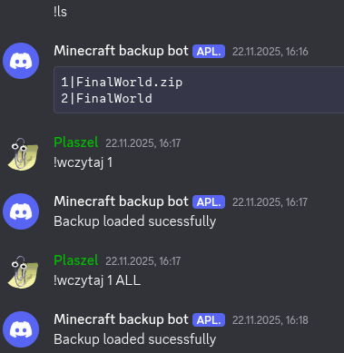
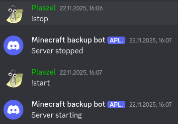
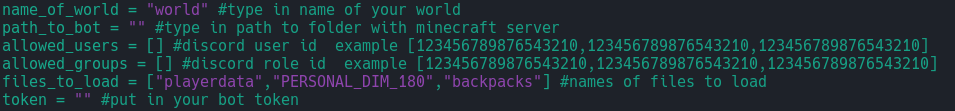

# GTNH-Discord-Server-Manager

This bot allows you and your friends to manage your GTNH server through discord bot.  

## Showcase

## ✨ Features of Bot

- **Starting and stoping the server**
- **Load backups, either files chosen by you or whole save**

## 🤖 Bot commands

- **!start** - start the server
- **!stop** - stops the server
- **!backups** - show list of available backups
- **!load (index of backup)** - loads chosen backup (By default loads only files from array, additionally you can add "ADD" for whole save file)
- **!help** - for list of commands

## 📌 Planned features
  
- **Version updater**
- **Single mod updater**
- **Passing commands to server**

## 🧰 Setup Guide

- **!!! Note that bot needs to be started by !start command to function properly**
- **Download Discord_Bot.py file and place it inside your server folder**
- **Download tmux package (Bot only supports server hosted on linux)**
- **Download discord library for python [Guide](https://pypi.org/project/discord.py/)**
- **Edit Discord_Bot.py file and put int those values:**

(Beggining of the file) 

- [**Guide to for seting up discord bot**](https://www.wikihow.com/Create-a-Bot-in-Discord) **!!! Note that you probably want your bot to be private** 
- **Then your bot is ready to go, all there is left to run it**

